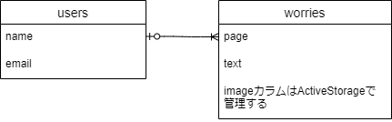
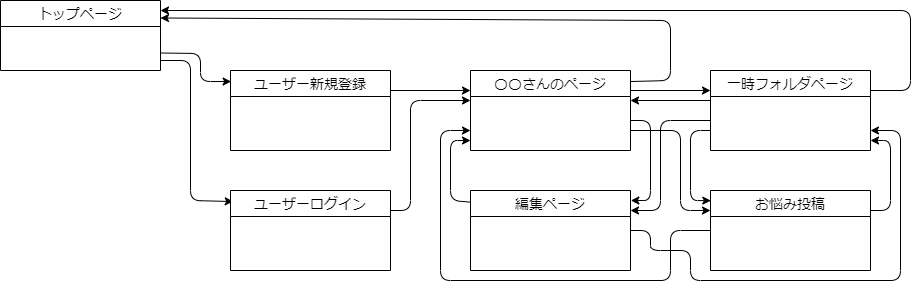

# アプリケーション名
  WorryAway

# アプリケーション概要
 どうしても解決できない問題に直面している人が、問題から頭を切り替えて他のタスクに専念するために、抱えてしまった問題を、頭からアプリに書き出して、消す作業を行う事ができるアプリ。	

# URL<要修正>
 [デプロイ後にのURL]()

# テスト用アカウント<要修正>
 ログイン機能等を実装した場合は、ログインに必要な情報を記載。
 またBasic認証等を設けている場合は、そのID/Passも記載すること。

# 利用方法<要修正>
  このアプリケーションの利用方法を記載。
  説明が長い場合は、箇条書きでリスト化すること。

# アプリケーションを作成した背景
  日々生活を送る中で自分では解決できない問題に遭遇することがあります。  
  「自分では解決できない問題」とは、自分以外の他人との関係によって発生し、自分だけの改善では解決しないようなことです。  
  例をあげると「職場の〇〇さんはいつも私にひどいことを言う」「部下の〇〇さんは何度注意しても同じミスを繰り返す」のようなもので、普通に考えるとそうならないように「自ら動き改善すればよい」「他人に相談して悩みを打ち明ければよい」と考えられますが、実際にそれを行動に移す事が出来る人ばかりではないと感じています。  
  自分では解決できないと感じていることを悩み続けてしまうとその負の感情を引きずることになり、気持ちの切り替えがうまくいきません。このような状態では頭のリソースを他に割り振ることができなくなってしまいます。  
  この課題に対して頭の中で忘れる（手放す）という「儀式」をしたら消せるのではないかと考えました。  
  実体験として、学習していてノートに書いた事は書いた瞬間から忘れているように感じたこともあります。これはノートに書いたことによって頭の中で覚えなくても良いと判断して、頭からデータを手放したのが原因ではないかと考えました。つまり消したいと考えているものを一度アプリ上でデータにして、それを視覚的に見えない状態にしてしまえば本当に忘れられるのではないかというのが本アプリの狙いです。

  後付けになりますが、調べたところによると、情報の書き出しによって記憶が薄れるという現象は「エクステンデッド・マインド（Extended Mind）」と呼ばれ、一部の学術的な研究の対象となっているようです。これは思考と情報処理は、単に個人の頭の中で行われるだけでなく、外部環境（例：メモやノート）との相互作用も含まれるのではないかというものです。

# 洗い出した要件
  [要件定義書](https://docs.google.com/spreadsheets/d/1lJ624QY2T9zIu7Egx6WgH9zsTUmmfPdQ/edit?usp=share_link&ouid=107969107240155363770&rtpof=true&sd=true)

# 実装した機能についての画像やGIFおよびその説明※<要修正>
  実装した機能について、それぞれどのような特徴があるのかを列挙する形で記載。画像はGyazoで、GIFはGyazoGIFで撮影すること。

# 実装予定の機能
  悩みを検索する機能

# データベース設計
  

# 画面遷移図
  

# 開発環境<要修正>
  使用した言語・サービスを記載。

# ローカルでの動作方法<要修正>
  git cloneしてから、ローカルで動作をさせるまでに必要なコマンドを記載。

# 工夫したポイント
  ・一時フォルダに移動したデータが時間とともに自動で消えるところ。

# 改善点<要修正>
  ・ページの遷移がもっと楽になるようにしたい。
  ・管理しやすいようにトップページを含めヘッダー等を共通にしたい。
  ・一覧表示をもっとシンプルに分かりやすくしたい。

# 制作
  10[h] x 7[day] = 70[h]

## usersテーブル
| Column              | Type        | Options                        |
| ------------------- | ----------- | ------------------------------ |
| name                | string      | null: false                    |
| email               | string      | null: false                    |
| encrypted_password  | string      | null: false                    |

### Association
- has_many :worries  # usersテーブルは複数のworriesを持つ

## worriesテーブル
| Column              | Type        | Options                        |
| ------------------- | ----------- | ------------------------------ |
| text                | text        |                                |
| page                | string      |                                |
| user_id             | references  | null: false, foreign_key: true |

### Association
- belongs_to :user  # worriesテーブルは一つのuserに所属する